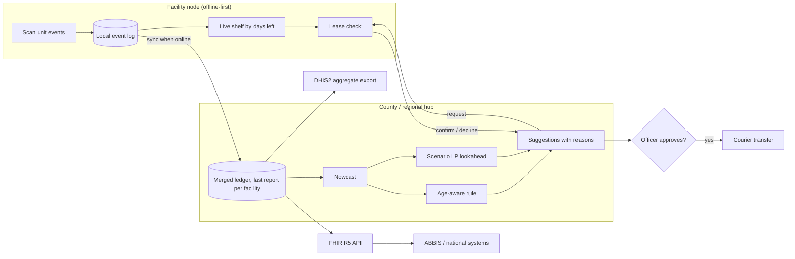

# Damu Grid: hackathon submission

Terumo BCT Africa Hackathon 2026 · priority workflow: **daily platelet rebalancing between facilities
under unreliable connectivity**. Live demo: https://blessingsmambwe.web.app/damu-grid/

Status key: **Built** = in this repository and running. **Designed** = specified here, not yet built.

---

## 1. Problem and user need

Blood services in Kenya collect about 180,000 units a year against a need of 400,000–500,000
(KNBTS, via Amref). The Strathmore / Pittsburgh / CPHD study in *The Lancet Global Health* (2026)
interviewed about 200 people in Siaya, Nakuru and Turkana and found shortages are not only about donors:
blood is stored far from where patients need it, while staff hunt for units by phone.

Platelets make this sharp: a unit lasts 5 days. Collection concentrates at the regional centre;
requests arrive everywhere; reports from rural facilities arrive late or not at all.

**Users:** blood bank officers at facilities (record stock, approve or reject transfers), the regional
coordinator (oversees the network), clinicians (raise requests).
**Need:** know where usable units are *today*, move them before they expire, and never promise a unit
that is no longer on the shelf.

## 2. End-to-end workflow

1. Facility devices record unit events offline (received, issued, expired, sent, received-in-transfer).
2. When a link is up, events sync to the county or regional hub. Links can be days late. *(Designed; the demo simulates per-facility delays.)*
3. **Nowcast (Built):** the hub estimates each facility's stock today from its last report, its own recent transfer plans and cautious expected usage.
4. **Decide (Built):** the engine proposes transfers, each with a reason:
   - *Expiry rescue:* "Nakuru uses about 4 units a day, so these would expire on its shelf. Siaya can use them in time."
   - *Top-up:* "Siaya is below its two-day safety level of 3 units. Nairobi holds more than it needs."
5. **Lease (Built):** each request goes to the sending facility, which confirms against its live shelf. At-risk units are always released; others only above the sender's own safety level.
6. **Human decision (Built in demo):** an officer approves or rejects each suggestion. Nothing moves without approval.
7. Courier moves the units (one day). The receiving facility scans them in, closing the trace.

## 3. Working technical slice (Built)

| Component | Where | Notes |
|---|---|---|
| Reference engine (Python) | `engine/perishnet` | Simulator, three policies, nowcast, leases, LP lookahead, perfect-information bound, benchmark. 35 tests. |
| Browser engine (JavaScript) | `web/js/engine.js` | Line-for-line port. `engine.test.js` checks 30 configurations against Python: identical totals. |
| Control-room demo | `web/index.html` | Kenya map, six facilities, live animation, approve/reject, per-facility data links, layer toggles, comparison against no coordination. |
| Evidence | `web/evidence.html`, `results/` | 900 simulation runs + 40 bound LPs on held-out futures; lease evaluation on 20 seeds. |

**Demo script (5 minutes):**
1. *Normal days.* Expiry rescues flow out of Nairobi; the footer counts units saved versus no coordination.
2. *Siaya and Lodwar go offline, no protection.* The hub "sees" stock that is already gone. Conflicts climb.
3. *Same outage, protected.* Nowcast and leases on. Conflicts stay at 0; cost drops back.
4. Untick *Auto-approve*. Reject one suggestion, apply the rest. The ledger records the decision.
5. Open *Evidence*: the stack is best or tied-best in every setting; nowcast halves cost under delay.

## 4. System architecture

**Data model (Designed).** The unit is the core entity, keyed on its ISBT 128 donation identification
number and product code. Each unit has an append-only event stream:
`collected → tested → released → stored → (reserved → in_transit →) issued → transfused | expired | discarded`.
The engine works on the aggregate `x[facility][days_left]`, derived from the events.

**APIs (Designed).** FHIR R5 `BiologicallyDerivedProduct` for units, `SupplyRequest` and `SupplyDelivery`
for transfers, `Procedure` for transfusion events (per the ISBT Working Party on IT guidance).
A DHIS2 aggregate export reports expiries, unmet requests and transfers per facility per week.

**Authentication (Designed).** Per-device keys; role-based access (officer, coordinator, viewer);
signed lease confirmations so a confirmation sent by SMS cannot be forged.

**Relationship to ABBIS.** Damu Grid is one module: the stock-coordination service. It consumes
unit events from any LIS or bank system and returns transfer suggestions; it does not replace them.

## 5. AI and data approach

| Element | Approach |
|---|---|
| Inputs | Per-facility stock by days left; transfers in flight; demand and supply rates (known in the prototype; to be estimated per facility). |
| Model choice | A rule with a structural basis (age-aware transshipment, Operations Research 2023) for explainability; a sample-average LP (Kleywegt et al. 2002) for scarce periods. Deep RL was considered and not chosen: published results show it only matches strong heuristics after heavy tuning (Gijsbrechts et al., MSOM 2022). |
| Evaluation | Tuned on training futures (seeds 1–6), evaluated on 20 held-out futures per setting with common random numbers, paired differences, 95% intervals and a perfect-information lower bound (Brown, Smith & Sun 2010). |
| Explainability | Every suggestion states its reason (expiry rescue or top-up) and the numbers behind it. |
| Monitoring | Track units expired, requests unmet, conflicts, declined requests and the nowcast's error against each late report. |
| Human oversight | Nothing moves without an officer's approval; rejections are logged. |
| Fallback | Rule runs on the facility device when the hub or solver is unavailable; leases still apply. |
| Data policy | Synthetic data only; no patient or donor identifiers in the stock ledger. |

## 6. Adaptability

Country and facility settings are parameters: shelf life (platelets 5 days; red cells by product),
safety level (days of cover × service level from the shortage/waste cost ratio), transfer cost and time,
number of facilities, link delays. The same code runs for 2–6 facilities in the demo and is
O(facilities × shelf-life) per decision for the rule; the LP grows with scenarios and can be
decomposed by scenario (progressive hedging) for larger networks.

## 7. Implementation pathway

1. **Pilot (3 months):** one county hub plus 4–6 facilities, platelets only, read-only suggestions alongside current practice; measure expiries and unmet requests against the previous year.
2. **Connect:** ingest unit events from the existing bank system (e.g. Damu-Sasa) through an adapter; FHIR façade; DHIS2 weekly export.
3. **Estimate demand:** per-facility Gamma–Poisson learning, then feature-based scenarios for the LP.
4. **Add blood groups:** ABO/Rh compatibility as a matching layer inside the same engine.
5. **Scale:** regional hubs, progressive hedging for the LP, SMS lease confirmations for low-connectivity sites.

**Where it could fail, and the response**

| Failure | Response |
|---|---|
| Hub plans on stale counts | Nowcast; leases make any remaining error safe (declined, not double-promised). |
| A facility over-gives and then runs short | Lease budget: only units above the sender's own safety level, plus units at risk, can leave. |
| Demand estimates wrong | Cautious quantile in the nowcast; monitor nowcast error; fall back to the rule. |
| Solver unavailable or slow | Rule runs locally; it ties the LP when data is fresh. |
| Mis-scanned labels | ISBT 128 check character validated at scan (designed). |
| Over-tuning to history | Constants kept principled; tuned variants were worse on unseen futures. |
