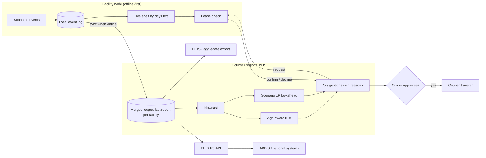

# Damu Grid: hackathon submission

Terumo BCT Africa Hackathon 2026 · selected priority workflow: **daily platelet rebalancing between
facilities under unreliable connectivity** (problem area: *redistribution between facilities*).

- Live working slice: https://blessingsmambwe.web.app/damu-grid/
- How it works: https://blessingsmambwe.web.app/damu-grid/method · Evidence: https://blessingsmambwe.web.app/damu-grid/evidence
- Code: https://github.com/bleymambwe/damu-grid

**Status key.** **Built** = in this repository, running and tested. **Designed** = specified here, not yet built.
All data is synthetic; facility names are real towns, every stock, demand and supply figure is simulated.

---

## At a glance (for judges)

| Brief requirement | Where it is answered | Status |
|---|---|---|
| 1 Problem and user need | §1 | Built (grounded in published Kenyan data) |
| 2 End-to-end workflow | §2 | Built in simulation; field sync Designed |
| 3 Prototype / technical slice ("static screens alone are not sufficient") | §3, live demo | **Built**: live engine, not mock-ups |
| 4 System architecture incl. ABBIS relationship | §4 | Engine Built; data model, APIs, auth Designed |
| 5 AI and data approach | §5 | Built and evaluated on held-out simulations |
| 6 Adaptability | §6 | Configuration Built; localisation, interop Designed |
| 7 Implementation pathway | §7 | Designed |
| "Where the architecture could fail" | §8 | Answered per failure mode |
| "AI suggestions, human decisions" | §2 step 6, §5 | Built: nothing moves without approval |

| Judging criterion | Strongest evidence |
|---|---|
| Technical depth, architecture, engineering judgment (20%) | Three-layer design (nowcast → decide → quota lease); Python reference engine with 35 tests; browser port matching Python on 30 configurations; failure-mode table §8 |
| AI/data architecture, evaluation, reliability (15%) | Held-out evaluation, paired comparisons, perfect-information lower bound, monitoring and fallback §5 |
| Scalability, interoperability, adaptability (15%) | Parameterised engine, FHIR/DHIS2 interface design, scaling route §6–7 |

---

## 1. Problem and user need

*Brief: "a clearly defined blood-bank or blood-service problem grounded in real operational, data and technical constraints."*

Kenya's blood service collects about 180,000 units a year against a need of 400,000–500,000
(KNBTS, via Amref). The Strathmore / Pittsburgh / CPHD study in *The Lancet Global Health* (2026)
interviewed about 200 people in Siaya, Nakuru and Turkana and found shortages are not only about donors:
blood is often stored far from where patients need it, and staff hunt for units by phone.

Platelets make this sharp: a unit lasts 5 days. Collection concentrates at the regional centre;
requests arrive at county hospitals; reports from rural facilities arrive late or not at all.

- **Users:** facility blood bank officers (record stock, approve or reject transfers); the regional
  coordinator (oversees the network); clinicians (raise requests).
- **Need:** know where usable units are *today*, move them before they expire, and never promise a unit
  that is no longer on the shelf.
- **Constraints the design takes as given:** intermittent connectivity (days of delay), 5-day shelf life,
  one-day courier transfers, staff time, and no real patient or donor data in this prototype.

## 2. End-to-end workflow

*Brief: "users, systems, data flows, integrations and operational dependencies."*

| Step | Who / what | Status |
|---|---|---|
| 1. Record unit events offline (received, issued, expired, sent, received-in-transfer) | Facility officer, facility device | Designed |
| 2. Sync events to the county or regional hub when a link is up; links may be days late | Facility device → hub | Simulated per facility in the demo |
| 3. **Nowcast**: estimate each facility's stock *today* from its last report, recent transfer plans and cautious (85th-percentile) expected usage | Hub engine | Built |
| 4. **Decide**: propose transfers, each with a plain reason (expiry rescue or top-up) | Hub engine | Built |
| 5. **Quota lease**: sending facility confirms each transfer against its live shelf; at-risk units always released, others only above its own safety level | Sending facility | Built |
| 6. **Human decision**: officer approves or rejects each suggestion; nothing moves otherwise | Coordinator / officer | Built in demo (auto-approve can be switched off) |
| 7. Courier moves units (one day); receiver scans them in, closing the trace | Courier, receiving facility | Designed |

Operational dependencies: a courier route between facilities, a device per facility, an SMS or data link
at least some of the time, and an officer available once a day to review suggestions.

## 3. Prototype / technical slice

*Brief: "a working technical slice demonstrating the selected priority workflow. Static screens alone are not sufficient."*

Everything on the demo page is computed live by the engine in the browser; nothing is pre-rendered.

| Component | Path | Status |
|---|---|---|
| Reference engine (Python): simulator, age-aware rule, nowcast, quota leases, scenario LP lookahead, perfect-information bound, benchmark | `engine/perishnet` | Built, 35 tests |
| Browser engine (JavaScript), line-for-line port | `web/js/engine.js` | Built; identical results to Python on 30 configurations (`web/js/engine.test.js`) |
| Control-room demo: map of six facilities, live transfers, approve/reject, per-facility data links, layer toggles, comparison with no coordination | `web/index.html`, `web/js/app.js` | Built, deployed |
| Benchmark and lease evaluation | `results/` | Built |

**Five-minute demo script**
1. *Normal days.* Expiry rescues flow out of Nairobi; the headline counts units saved versus no coordination.
2. *Siaya and Lodwar go offline, no protection.* The hub "sees" stock that is already gone; conflicts climb.
3. *Same outage, protected.* Nowcast and quota leases on; conflicts stay at 0.
4. Untick *Auto-approve*, reject one suggestion, apply the rest; the ledger records the decision.
5. Open *Evidence*: the measured effect of each layer.

## 4. System architecture

*Brief: "core services and components, data models, APIs, information flows, integrations, authentication, interoperability and the proposed relationship to ABBIS."*

| Element | Design | Status |
|---|---|---|
| Core services | Facility node (event log, live shelf, lease check); hub (merged ledger, nowcast, decision engine, suggestion service) | Engine Built; services Designed |
| Data model | Unit keyed on ISBT 128 donation identification number + product code; append-only events `collected → tested → released → stored → (reserved → in_transit →) issued → transfused / expired / discarded`. The engine works on the aggregate `stock[facility][days_left]` derived from events | Aggregate Built; event model Designed |
| APIs | FHIR R5: `BiologicallyDerivedProduct` (unit), `SupplyRequest` / `SupplyDelivery` (transfer), `Procedure` (transfusion), following ISBT Working Party on IT guidance | Designed |
| Integrations | Adapter from existing bank systems (e.g. Damu-Sasa) into unit events; weekly DHIS2 aggregate export (expiries, unmet requests, transfers per facility) | Designed |
| Authentication | Per-device keys; roles (officer, coordinator, viewer); signed lease confirmations so an SMS confirmation cannot be forged | Designed |
| Information flows | Events up (facility → hub); suggestions down; confirmations back up; aggregates out to ABBIS/DHIS2 | Simulated |

**Relationship to ABBIS.** ABBIS is described as an interoperable platform connecting blood centres,
hospitals, laboratories, health workers and policymakers around trusted blood-service data. Damu Grid is
proposed as **one module of it: the stock-coordination service**. It consumes unit events from whatever
bank or laboratory system a facility already uses, returns transfer suggestions, and publishes aggregates
upward. It does not replace those systems or hold patient data.

## 5. AI and data approach

*Brief: "data inputs, approach or model selection, evaluation, explainability, monitoring, human oversight and fallback."*

| Element | Approach | Status |
|---|---|---|
| Data inputs | Stock per facility by days of shelf life left; transfers in flight; per-facility data delay; demand and supply rates (given to the engine in the prototype, estimated per facility in a pilot) | Built (rates given) |
| Model selection | Nowcast (predict today's stock through the delay, as a Smith predictor does in control); age-aware transfer rule from perishable-inventory research for explainability; rolling scenario LP (sample-average approximation, 3 days × 16 sampled futures) where supply is scarce. Deep reinforcement learning was considered and not chosen: published results show it only matches strong heuristics after heavy tuning | Built |
| Evaluation | Constants tuned on training futures (seeds 1–6) and evaluated on 20 held-out futures per setting with common random numbers, paired differences, 95% intervals and a perfect-information lower bound. Results in `results/` | Built |
| Explainability | Every suggestion states its reason and the numbers behind it, e.g. "Nakuru uses about 4 units a day, so these would expire on its shelf. Nairobi can use them in time." | Built |
| Monitoring | Units expired, requests unmet, conflicts, units declined by senders, and the nowcast's error against each late report | Metrics Built; error tracking Designed |
| Human oversight | Nothing moves without an officer's approval; rejections are logged in the ledger | Built in demo |
| Fallback | The rule runs on a facility device when the hub or solver is unavailable; leases still apply; constants fall back to plain safety levels if nowcast error grows | Rule and leases Built; error trigger Designed |

**Measured results (cost per unit of demand; waste = 1, unmet request = 5, transfer = 0.3 per unit):**

| Setting (20 held-out futures) | No coordination | Age-aware rule | + Nowcast | Best stack | Perfect-foresight bound |
|---|---|---|---|---|---|
| Fresh data | 2.024 | 0.304 | — | 0.299 (scenario LP; tie with rule, difference not significant) | 0.203 |
| 2-day data delay | 2.024 | 0.652 | 0.371 | 0.340 (nowcast → LP) | 0.203 |
| 4-day data delay | 2.024 | 0.953 | 0.439 | 0.350 (nowcast → band rule) | 0.203 |
| Scarce supply landing in one place (unmet = 10) | 5.630 | 1.635 | — | 1.230 (scenario LP) | 0.788 |

Quota leases (separate test, 20 seeds): conflicts go from 1,619 per year to 0 at a 2-day delay; with the
nowcast on, leases change cost by at most about 2%.

## 6. Adaptability

*Brief: "configuration, localisation, interoperability and scaling across different blood banks and markets."*

| Dimension | How | Status |
|---|---|---|
| Configuration | Shelf life, safety level (days of cover × service level from the shortage/waste cost ratio), transfer cost and time, number of facilities, per-facility data delay are parameters | Built |
| Products | Platelets (5 days) in the demo; red cells or plasma by changing shelf life and safety level | Built (parameter) |
| Localisation | Interface strings in one place for translation (English, Kiswahili, French); units, date formats and facility names from configuration | Designed |
| Interoperability | FHIR R5 resources and DHIS2 export (§4); adapters for existing bank systems | Designed |
| Scaling | The rule costs O(facilities × shelf-life days) per decision and runs on a phone; the LP grows with scenarios and can be split by scenario (progressive hedging) for large networks | Rule Built; LP decomposition Designed |

## 7. Implementation pathway

*Brief: "technical dependencies, MVP architecture, deployment considerations and a realistic route from concept to a controlled pilot."*

- **Technical dependencies:** Python 3 with SciPy (HiGHS LP solver) for the hub; any modern browser for the
  facility interface; a source of unit events (existing bank system or barcode scanning); SMS gateway for
  low-connectivity sites.
- **MVP architecture:** one hub service (nowcast, rule, LP, suggestion API) and a browser or Android client
  per facility with local storage; nightly sync, SMS fallback for lease confirmations.
- **Deployment considerations:** works offline at facilities; hub can run on a county server or cloud;
  no patient identifiers in the stock ledger; role-based access; audit log of every decision.
- **Route to a controlled pilot:**
  1. *Shadow mode (3 months):* one county hub and 4–6 facilities, platelets only. Suggestions shown alongside
     current practice, not acted on. Measure expiries and unmet requests against the previous year.
  2. *Connect:* event adapter from the existing bank system; FHIR façade; DHIS2 weekly export.
  3. *Estimate demand:* per-facility learning of demand rates (Gamma–Poisson), then feature-based scenarios for the LP.
  4. *Add blood groups:* ABO/RhD compatibility as a matching layer in the same engine.
  5. *Scale:* regional hubs, LP decomposition, SMS lease confirmations for remote sites.

## 8. Where the architecture could fail, and how it responds

| Failure | Response | Status |
|---|---|---|
| Hub plans on stale counts | Nowcast; leases make any remaining error safe (declined, never double-promised) | Built |
| A facility gives away stock and then runs short | Lease budget: only units above the sender's own safety level, plus units at risk of expiring, can leave | Built |
| Demand estimates are wrong | Cautious quantile in the nowcast; monitor nowcast error; fall back to the rule and plain safety levels | Partly Built |
| Solver unavailable or slow | Rule runs locally; it ties the LP when data is fresh | Built |
| Officer rejects good suggestions or is unavailable | Suggestions persist in the queue; leases still protect stock; rejections are logged for review | Built in demo |
| Mis-scanned labels | ISBT 128 check character validated at scan | Designed |
| Over-tuning to history | Constants kept principled; tuned variants were worse on unseen futures | Built (evidence) |
| Courier does not arrive | Units in transit keep ageing in the model; receiver confirms on arrival before stock counts | Partly Built |

## Known limits of the prototype

- Demand and supply rates are given to the engine; a pilot must estimate them.
- One product without blood groups; ABO/RhD matching is still to add.
- Transfers take one day between any two facilities at the same cost.
- The demo runs the rule live; the scenario LP is benchmarked in Python, not run in the browser.
- FHIR, DHIS2, authentication and ISBT 128 scanning are designs, not code.
